# Flowchart Swimlane Penjualan (Hitam-Putih)
### **CV Bintang Jaya Komputer**

Flowchart ini memisahkan peran **Pelanggan (Customer/Guest)** di kolom sebelah kiri dan **Administrator (Admin)** di kolom sebelah kanan menggunakan pembatas kolom (*Swimlane Subgraph*). Semua titik keputusan (*Decision*) menggunakan percabangan biner standar ("Ya" / "Tidak").

---

## 📊 Diagram Alur Swimlane (Hitam-Putih)

```mermaid
%%{init: {'theme': 'neutral', 'themeVariables': { 'background': '#ffffff', 'primaryColor': '#ffffff', 'edgeColor': '#000000', 'lineColor': '#000000', 'textColor': '#000000' }}}%%
flowchart TD
    %% --- KOLOM PERAN 1: PELANGGAN (KIRI) ---
    subgraph Pelanggan ["Pelanggan (Customer / Guest)"]
        Start([Start: Buka Katalog])
        ViewCatalog[Display: Tampilkan Katalog Produk Aktif]
        CustBooking[\Manual Input: Isi Form Booking di Detail Produk\]
        CheckBookingVal{Decision: Validasi Form OK?}
        SaveBooking[(Database: Simpan ke product_bookings)]
        DispSuccess[Display: Notifikasi Sukses Pemesanan]
        DelayPickup[Delay: Menunggu Pengambilan Barang di Toko]
        OpenPOS{{Manual Operation: Datang ke Toko & Buka Menu POS}}
        PayProcess{{Manual Operation: Pembayaran Cash / Transfer}}
        Handover{{Manual Operation: Menerima Barang & Invoice}}
        
        %% Blok Decision Biner Sekuensial
        CheckBatal{Decision: Apakah transaksi dibatalkan?}
        CheckKomplain{Decision: Apakah ada keluhan/komplain?}
        CheckRetur{Decision: Apakah ada retur barang?}
        
        CustComplaint[\Manual Input: Isi Widget Komplain & No Invoice\]
        CheckInvoice{Decision: Nomor Invoice Valid?}
        LinkOrder[Process: Hubungkan ke order_id]
        MarkText[Process: Tandai Invoice Tidak Ditemukan]
        SaveComplaint[(Database: Simpan ke complaints)]
        CustResolve{{Manual Operation: Menerima Solusi Komplain}}
        
        RequestReturn{{Manual Operation: Ajukan Retur & Bawa Fisik Barang}}
        SwapItem{{Manual Operation: Menerima Barang Pengganti / Dana}}
        EndApp([End: Selesai])
    end

    %% --- KOLOM PERAN 2: ADMINISTRATOR (KANAN) ---
    subgraph Admin ["Administrator (Admin)"]
        LoginAdmin{{Manual Operation: Admin Login ke Panel}}
        DispNewBooking[Display: Lihat Booking Baru]
        ConnectWA{{Manual Operation: Hubungi Pelanggan via WA}}
        OpenPOSAdmin[Display: Buka Menu POS]
        InputPOS[\Manual Input: Pilih Item DB atau Input Manual & Qty\]
        CheckStock{Decision: Produk DB & Stok Cukup?}
        ProcessStock[[Predefined Process: Kurangi Stok Produk & Catat Riwayat 'out']]
        SaveOrder[(Database: Simpan Transaksi Baru ke orders)]
        ConfirmPay[\Manual Input: Admin Klik Konfirmasi Lunas\]
        UpdatePayState[Process: Set Status orders & payments Lunas]
        GenInvoice[Document: Generate Invoice PDF]
        PrintInvoice{{Manual Operation: Cetak & Serah Invoice}}
        
        CancelOrder[\Manual Input: Admin Klik Batalkan Transaksi\]
        RollbackStock[Process: Ubah orders 'Dibatalkan' & Kembalikan Stok]
        LogCancelHist[(Stored Data: Catat Riwayat return)]
        
        AdminResolve{{Manual Operation: Membaca Komplain & Hubungi Pelanggan}}
        UpdateComplaint[\Manual Input: Admin Set Status Komplain Selesai\]
        
        InputReturn[\Manual Input: Admin Input Transaksi, Produk, Qty Retur & Alasan\]
        ValidQty{Decision: Qty Retur <= Qty Beli?}
        SaveReturn[(Database: Simpan ke returns)]
        ReviewReturn{Decision: Admin Menyetujui Retur?}
        RejectReturn[Process: Set status returns Ditolak]
        ApproveReturn[[Predefined Process: Set status Disetujui & Stok Kembali]]
        
        ReportMenu{{Manual Operation: Admin Buka Menu Laporan}}
        CompileReport[Process: Sistem Rekap Laba & Transaksi]
        GenReport[Multiple Documents: Unduh PDF Laporan Bulanan]
    end

    %% --- KONEKSI DAN ARUS DI ANTARA KOLOM ---
    
    %% Alur 1: Katalog & Pemesanan (Online)
    Start --> ViewCatalog
    ViewCatalog --> CustBooking
    CustBooking --> CheckBookingVal
    CheckBookingVal -- Tidak --> CustBooking
    CheckBookingVal -- Ya --> SaveBooking
    SaveBooking --> DispSuccess
    
    %% Menyeberang dari Kiri ke Kanan (Notifikasi Booking Baru)
    DispSuccess --> DispNewBooking
    DispNewBooking --> ConnectWA
    
    %% Menyeberang kembali ke Kiri (Hubungi via WA & Menunggu)
    ConnectWA --> DelayPickup
    DelayPickup --> OpenPOS
    
    %% Inisiasi Admin Paralel
    LoginAdmin --> OpenPOSAdmin
    
    %% Alur Kasir POS (Pengerjaan Bersama di Toko)
    OpenPOS --> InputPOS
    OpenPOSAdmin --> InputPOS
    InputPOS --> CheckStock
    CheckStock -- Tidak --> InputPOS
    CheckStock -- Ya --> ProcessStock
    ProcessStock --> SaveOrder
    
    %% Pembayaran (Kiri-Kanan)
    SaveOrder --> PayProcess
    PayProcess --> ConfirmPay
    ConfirmPay --> UpdatePayState
    UpdatePayState --> GenInvoice
    GenInvoice --> PrintInvoice
    
    %% Serah terima barang & Invoice (Kanan ke Kiri)
    PrintInvoice --> Handover
    
    %% --- KEPUTUSAN BINER SEKUENSIAL SETELAH SERAH TERIMA ---
    Handover --> CheckBatal
    
    %% 1. Cek Pembatalan (Ya/Tidak)
    CheckBatal -- Ya --> CancelOrder
    CancelOrder --> RollbackStock
    RollbackStock --> LogCancelHist
    LogCancelHist --> EndApp
    
    CheckBatal -- Tidak --> CheckKomplain
    
    %% 2. Cek Komplain (Ya/Tidak)
    CheckKomplain -- Ya --> CustComplaint
    CustComplaint --> CheckInvoice
    CheckInvoice -- Ya --> LinkOrder
    CheckInvoice -- Tidak --> MarkText
    LinkOrder --> SaveComplaint
    MarkText --> SaveComplaint
    SaveComplaint --> AdminResolve
    AdminResolve --> UpdateComplaint
    UpdateComplaint --> CustResolve
    CustResolve --> EndApp
    
    CheckKomplain -- Tidak --> CheckRetur
    
    %% 3. Cek Retur (Ya/Tidak)
    CheckRetur -- Ya --> RequestReturn
    RequestReturn --> InputReturn
    InputReturn --> ValidQty
    ValidQty -- Tidak --> InputReturn
    ValidQty -- Ya --> SaveReturn
    SaveReturn --> ReviewReturn
    
    ReviewReturn -- Ya --> ApproveReturn
    ReviewReturn -- Tidak --> RejectReturn
    ApproveReturn --> SwapItem
    RejectReturn --> SwapItem
    SwapItem --> EndApp
    
    %% 4. Jika Tidak Ada Kendala/Lainnya -> Lanjut Laporan
    CheckRetur -- Tidak --> ReportMenu
    ReportMenu --> CompileReport
    CompileReport --> GenReport
    GenReport --> EndApp

    %% --- STYLING MONOKROM UNTUK SEMUA SHAPE ---
    classDef bw fill:#ffffff,stroke:#000000,stroke-width:1px,color:#000000;
    class bw Start,ViewCatalog,CustBooking,CheckBookingVal,SaveBooking,DispSuccess,DelayPickup,OpenPOS,PayProcess,Handover,CheckBatal,CheckKomplain,CheckRetur,CustComplaint,CheckInvoice,LinkOrder,MarkText,SaveComplaint,CustResolve,RequestReturn,SwapItem,EndApp;
    class bw LoginAdmin,DispNewBooking,ConnectWA,OpenPOSAdmin,InputPOS,CheckStock,ProcessStock,SaveOrder,ConfirmPay,UpdatePayState,GenInvoice,PrintInvoice,CancelOrder,RollbackStock,LogCancelHist,AdminResolve,UpdateComplaint,InputReturn,ValidQty,SaveReturn,ReviewReturn,RejectReturn,ApproveReturn,ReportMenu,CompileReport,GenReport;
```

---

## 2. Tabel Peran Terpadu (Kolom Kiri: Customer, Kolom Kanan: Admin)

Tabel di bawah ini membagi alur kerja secara kronologis ke dalam dua kolom peran: **Pelanggan di sebelah kiri** dan **Admin di sebelah kanan**.

| Pelanggan (Customer/Guest) | Administrator (Admin) |
|:---|:---|
| **(Start)** Mengakses halaman utama katalog publik | - |
| **[Disp]** Melihat daftar produk aktif, harga jual, dan stok | - |
| **[MI]** Mengisi form booking produk di detail halaman produk (Nama, WhatsApp, Waktu Ambil, Catatan) dan mengirimkannya | - |
| **\<Decision\>** Sistem memvalidasi kelayakan data input booking   *[Jika tidak valid, diarahkan kembali ke form]* | - |
| **[DB]** Sistem menyimpan data booking baru ke tabel `product_bookings` dengan status `"Menunggu"` | - |
| **[Disp]** Menerima pesan konfirmasi sukses booking di layar | - |
| - | **\<P\> [Preparation]** Melakukan Login Admin menggunakan email & password untuk masuk ke dashboard |
| - | **[Disp]** Membuka daftar pesanan baru di dashboard admin dan memantau notifikasi booking |
| - | **[MO]** Menghubungi pelanggan via WhatsApp untuk konfirmasi detail pengambilan |
| **(Dly)** Menunggu waktu pengambilan barang yang telah disepakati bersama | - |
| **[MO]** Datang ke toko fisik untuk mengambil produk yang dipesan | **[Disp]** Membuka menu Kasir POS untuk inisiasi transaksi penjualan offline |
| - | **[MI]** Memilih produk database atau mengetik manual item barang belanjaan beserta kuantitasnya |
| - | **\<Decision\>** Sistem memvalidasi ketersediaan stok produk di database   *[Jika stok habis, transaksi ditolak]* |
| - | **[[ ]] [Predefined Process]** Sistem memproses pemotongan kuantitas produk di DB secara otomatis |
| - | **[DB]** Sistem membuat nomor invoice unik `INV/YYYYMMDD/XXXX` dan menyimpannya ke tabel `orders` dengan status `"Belum Dibayar"` |
| - | **[SD]** Sistem mencatat riwayat perubahan stok ke tabel `stock_histories` dengan tipe `"out"` |
| **[MO]** Membayar belanjaan via Cash (Tunai) atau Transfer bank | **[MO]** Menerima uang fisik atau memverifikasi bukti transfer pembayaran pelanggan |
| - | **[MI]** Mengklik tombol `"Konfirmasi Lunas"` pada halaman kasir |
| - | **[Process]** Sistem mengupdate status order menjadi `"Lunas"` pada tabel `orders` & `payments` |
| - | **[D] [Document]** Sistem membuat berkas Invoice PDF terformat otomatis |
| **[MO]** Menerima produk fisik dan struk/nota belanja cetak | **[MO]** Mencetak & menyerahkan Invoice fisik dan barang belanjaan kepada pelanggan |
| - | **(1. CEK PEMBATALAN TRANSAKSI)**   **\<Decision\>** Apakah transaksi dibatalkan?   *[Jika Ya, lanjut ke baris berikutnya]* |
| - | **[MI]** Membuka detail transaksi lunas dan mengklik tombol `"Batalkan Transaksi"` |
| - | **[Process]** Sistem mengubah status order menjadi `"Dibatalkan"` dan mengembalikan kuantitas barang ke stok database |
| - | **[SD]** Sistem mencatat riwayat pengembalian stok ke tabel `stock_histories` dengan tipe `"return"`   *[Alur berakhir / End]* |
| **(2. CEK KELUHAN & KOMPLAIN)**   **\<Decision\>** Apakah ada keluhan/komplain dari pelanggan?   *[Jika Ya, lanjut ke baris berikutnya]* | - |
| **[MI]** Mengisi widget keluhan komplain di website (Nama, Kontak, Keluhan, Invoice) | - |
| **\<Decision\>** Sistem memvalidasi nomor invoice   *[Jika invoice terdaftar, dihubungkan ke data order]* | - |
| **[DB]** Sistem menyimpan keluhan pelanggan ke tabel `complaints` dengan status awal `"Menunggu"` | - |
| - | **[MO]** Membaca keluhan pelanggan di dashboard admin dan menghubungi pelanggan |
| - | **[MI]** Mengubah status komplain menjadi `"Selesai"` di sistem setelah solusi diberikan |
| **[MO]** Menerima solusi penanganan komplain dari pihak admin   *[Alur berakhir / End]* | - |
| **(3. CEK RETUR BARANG RUSAK)**   **\<Decision\>** Apakah ada pengajuan retur barang?   *[Jika Ya, lanjut ke baris berikutnya]* | - |
| **[MO]** Mendatangi toko membawa produk cacat fisik beserta invoice belanja | **[MO]** Menerima barang bermasalah dan memverifikasi invoice pembelian |
| - | **[MI]** Membuka menu Retur Barang dan menginput kuantitas barang serta alasan retur |
| - | **\<Decision\>** Sistem memvalidasi apakah jumlah barang yang diretur tidak melebihi kuantitas pembelian awal |
| - | **[DB]** Sistem menyimpan data retur ke tabel `returns` dengan status awal `"Menunggu"` |
| - | **\<Decision\>** Admin memutuskan persetujuan retur (Setuju / Tolak) |
| - | **[[ ]] [Predefined Process]** Jika disetujui, sistem memproses pengembalian stok produk & mencatat audit trail `type: return` |
| **[MO]** Menerima barang pengganti baru atau pengembalian dana belanja   *[Alur berakhir / End]* | **[MO]** Menyerahkan produk pengganti/dana sesuai kesepakatan retur |
| - | **(4. PELAPORAN OPERASIONAL)**   **[MO]** Membuka menu Laporan Penjualan di panel admin untuk rekap bulanan |
| - | **[Process]** Sistem mengompilasi total transaksi, laba, komplain, dan retur |
| - | **[DD] [Multiple Documents]** Mengunduh file PDF Laporan Penjualan bulanan, persediaan, dan laba-rugi |
| **(End)** Siklus belanja selesai | **(End)** Siklus operasional toko selesai & pembukuan terdokumentasi |

---
*Catatan: Modifikasi dan perubahan alur lebih lanjut harus diperbarui pada flowchart tunggal monokrom ini agar menjaga konsistensi alur kerja lintas peran.*
