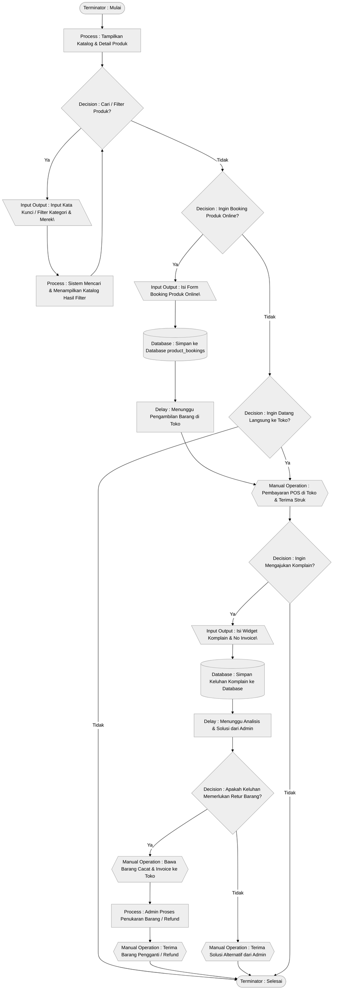

# 📊 Flowchart Dokumentasi Sistem (Ringkas)
### **CV Bintang Jaya Komputer**

Dokumen ini berisi diagram alur (*flowchart*) ringkas untuk masing-masing peran (*role*) dalam **Sistem Informasi Penjualan CV Bintang Jaya Komputer**:
1. **Pelanggan (Customer / Guest)**
2. **Administrator (Admin)**

Serta menyertakan **Flowchart Swimlane (Kolaborasi)** untuk menggambarkan interaksi lintas peran antara Pelanggan dan Admin secara ringkas dan padat.

> [!IMPORTANT]
> **Aturan Struktur Flowchart:**
> 1. Semua simbol keputusan (*decision*) hanya menggunakan percabangan biner standar (**Ya** dan **Tidak**).
> 2. Simbol proses (*process* / *predefined process*) tidak boleh saling terhubung secara langsung tanpa adanya perantara (seperti *Decision*, *Input*, *Manual Operation*, *Database*, atau *Document*).
> 3. Teks di dalam simbol diagram diawali dengan nama tipe simbolnya (contoh: `"Input Output : Isi Form"`).
> 4. Setiap flowchart diawali dengan simbol terminator `"Mulai"` dan diakhiri dengan simbol terminator `"Selesai"`.

---

## 📌 Daftar Isi
1. [Overview Peran Pengguna](#-overview-peran-pengguna)
2. [Flowchart Pelanggan (Customer / Guest)](#-flowchart-pelanggan-customer--guest)
   - [Diagram Alur Pelanggan](#diagram-alur-pelanggan)
   - [Penjelasan Langkah Pelanggan](#penjelasan-langkah-pelanggan)
3. [Flowchart Administrator (Admin)](#-flowchart-administrator-admin)
   - [Diagram Alur Administrator](#diagram-alur-administrator)
   - [Penjelasan Langkah Administrator](#penjelasan-langkah-administrator)
4. [Flowchart Swimlane (Kolaborasi Pelanggan & Admin)](#-flowchart-swimlane-kolaborasi-pelanggan--admin)
   - [Diagram Alur Swimlane](#diagram-alur-swimlane)
   - [Tabel Kronologi Interaksi](#tabel-kronologi-interaksi)
5. [Hubungan Alur dengan Struktur Database & Service Layer](#-hubungan-alur-dengan-struktur-database--service-layer)

---

## 👥 Overview Peran Pengguna

| Peran | Saluran Akses | Deskripsi & Hak Akses |
| :--- | :--- | :--- |
| **Pelanggan (Guest/Customer)** | Public Marketplace (Front-End) | Pengunjung umum yang mengakses katalog produk secara online. Dapat mencari produk, melakukan reservasi/booking produk, serta mengirim komplain secara online. |
| **Administrator (Admin)** | Panel Admin (Back-Office) | Pengelola toko internal. Memiliki akses penuh setelah login untuk mengelola produk, stok, transaksi POS, penanganan booking, persetujuan retur, penyelesaian komplain, serta pencetakan laporan. |

---

## 🛒 Flowchart Pelanggan (Customer / Guest)

### Diagram Alur Pelanggan



### Penjelasan Langkah Pelanggan

| ID Langkah | Tipe Simbol | Aktivitas & Penjelasan |
| :--- | :--- | :--- |
| **Start** | Terminator | Mulai - Pelanggan mengakses katalog online toko. |
| **ViewCatalog** | Process | Sistem menampilkan daftar katalog produk beserta spesifikasinya. |
| **SearchAction** | Decision | Pelanggan memilih untuk mencari produk tertentu (Ya/Tidak). |
| **InputQuery** | Input Output | Pelanggan memasukkan kata kunci pencarian atau memilih filter. |
| **ProcessSearch** | Process | Sistem menyaring katalog dan menampilkan produk yang dicari. |
| **CheckBooking** | Decision | Pelanggan menentukan apakah ingin melakukan booking produk secara online (Ya/Tidak). |
| **FillBookingForm** | Input Output | Pelanggan mengisi formulir booking produk online. |
| **SaveBooking** | Database | Sistem menyimpan pesanan booking ke tabel `product_bookings` dengan status `"Menunggu"`. |
| **WaitPickup** | Delay | Pelanggan menunggu waktu penjemputan barang ke toko. |
| **CheckLangsung** | Decision | Pelanggan menentukan apakah ingin langsung membeli secara offline ke toko (Ya/Tidak). |
| **TransactStore** | Manual Operation | Pelanggan melakukan pembayaran kasir secara fisik di toko. |
| **CheckKomplain** | Decision | Pelanggan menentukan apakah ada masalah pada barang dan ingin mengajukan komplain (Ya/Tidak). |
| **FillComplaint** | Input Output | Pelanggan menginput nama, nomor invoice, and detail keluhan pada widget komplain online. |
| **SaveComplaint** | Database | Sistem menyimpan keluhan pelanggan ke database tabel `complaints`. |
| **WaitResolve** | Delay | Keluhan dianalisis oleh admin sebelum memberikan solusi. |
| **CheckPerluRetur** | Decision | Menentukan apakah penanganan keluhan memerlukan penukaran barang fisik di toko (Ya/Tidak). |
| **VisitStore** | Manual Operation | Pelanggan membawa barang bermasalah dan struk pembelian ke toko. |
| **ProcessRetur** | Process | Admin mendaftarkan retur ke sistem dan memproses pergantian barang. |
| **RecvSwap** | Manual Operation | Pelanggan menerima barang pengganti yang baru atau uang kembali. |
| **GetSolution** | Manual Operation | Pelanggan menerima solusi penyelesaian non-fisik. |
| **EndCustomer** | Terminator | Selesai - Alur interaksi pelanggan dengan sistem berakhir. |

---

## 🛡️ Flowchart Administrator (Admin)

### Diagram Alur Administrator

```mermaid
%%{init: {'theme': 'neutral', 'themeVariables': { 'background': '#ffffff', 'primaryColor': '#ffffff', 'edgeColor': '#000000', 'lineColor': '#000000', 'textColor': '#000000' }}}%%
flowchart TD
    StartAdmin([Terminator : Mulai]) --> InputCreds[\"Input Output : Input Email & Password Admin\"\]
    InputCreds --> ValidateAuth{Decision : Kredensial Valid?}
    ValidateAuth -- Tidak --> InputCreds
    ValidateAuth -- Ya --> AccessDashboard[Process : Tampilkan Dashboard Admin]
    
    %% Alur 1: Kelola Master & Stok Toko
    AccessDashboard --> InputMaster[\"Input Output : Kelola Data Master & Stok Toko\"\]
    InputMaster --> SaveMasterDB[(Database : Simpan Perubahan ke Database)]
    
    %% Alur 2: Cek Booking Online Pelanggan
    SaveMasterDB --> CheckBooking{Decision : Apakah Ada Booking Online Baru?}
    CheckBooking -- Ya --> ConfirmBooking[\"Input Output : Hubungi Pelanggan via WA & Konfirmasi Booking\"\]
    ConfirmBooking --> SaveBookingDB[(Database : Simpan Perubahan Booking)]
    SaveBookingDB --> OpenPOS[Process : Proses Penjualan POS Kasir & Pemotongan Stok]
    
    %% Alur 3: Cek Pembelian Offline jika tidak ada booking
    CheckBooking -- Tidak --> CheckTransaksiOffline{Decision : Apakah Ada Pembelian Offline di Toko?}
    CheckTransaksiOffline -- Ya --> OpenPOS
    CheckTransaksiOffline -- Tidak --> CheckKomplain{Decision : Apakah Ada Komplain Masuk?}
    
    %% Kasir Penjualan POS (Hanya jalan jika ada booking ATAU beli offline)
    OpenPOS --> ConfirmPayment[\"Input Output : Konfirmasi Pembayaran & Cetak Invoice\"\]
    ConfirmPayment --> PrintInvoice{{Manual Operation : Serahkan Barang & Invoice kepada Pelanggan}}
    PrintInvoice --> CheckKomplain
    
    %% Alur 4: Kelola Keluhan Komplain & Retur
    CheckKomplain -- Ya --> ReviewComplaint[Process : Tinjau Keluhan & Verifikasi Invoice]
    ReviewComplaint --> ReviewRetur{Decision : Apakah Keluhan Membutuhkan Retur?}
    
    %% Penanganan Retur Fisik Toko
    ReviewRetur -- Ya --> ProcessRetur[\"Input Output : Proses Retur Barang & Pengembalian Stok\"\]
    ProcessRetur --> SaveComplaintDB[(Database : Simpan Hasil Penanganan & Selesaikan Komplain)]
    SaveComplaintDB --> OpenReportMenu[Process : Filter Periode & Tampilkan Preview Laporan]
    
    %% Solusi Keluhan Tanpa Retur
    ReviewRetur -- Tidak --> SaveComplaintDB
    
    %% Kasus Normal: Tanpa Komplain
    CheckKomplain -- Tidak --> OpenReportMenu
    
    %% Alur 5: Cetak Laporan & Selesai
    OpenReportMenu --> DownloadPDF{{Manual Operation : Unduh Laporan PDF Penjualan}}
    DownloadPDF --> EndAdmin([Terminator : Selesai / Logout])
```



### Penjelasan Langkah Administrator

| ID Langkah | Tipe Simbol | Aktivitas & Penjelasan |
| :--- | :--- | :--- |
| **StartAdmin** | Terminator | Mulai - Halaman Login panel admin. |
| **ValidateAuth** | Decision | Sistem memvalidasi kredensial login admin. |
| **AccessDashboard** | Process | Tampilkan Dashboard Admin utama yang memuat statistik toko. |
| **InputMaster** | Input Output | Menginputkan data master produk/supplier/pelanggan baru atau pembaruan stok. |
| **SaveMasterDB** | Database | Menyimpan penambahan atau modifikasi data master dan stok ke database. |
| **CheckBooking** | Decision | Menentukan apakah ada pesanan booking online baru dari pelanggan (Ya/Tidak). |
| **ConfirmBooking** | Input Output | Menghubungi pelanggan via WhatsApp dan mengonfirmasi jadwal penjemputan barang. |
| **SaveBookingDB** | Database | Menyimpan perubahan status booking terbaru ke database. |
| **CheckTransaksiOffline** | Decision | Menentukan apakah ada transaksi pembelian offline langsung dari pelanggan yang datang ke toko (Ya/Tidak). |
| **OpenPOS** | Process | Membuka POS kasir, menginput item belanjaan, memotong stok, dan membuat transaksi baru. |
| **ConfirmPayment** | Input Output | Admin memilih jenis pembayaran dan mengonfirmasi lunas transaksi kasir. |
| **PrintInvoice** | Manual Operation | Menyerahkan struk cetak fisik dan barang ke pembeli. |
| **CheckKomplain** | Decision | Menentukan apakah ada komplain masuk dari pelanggan (Ya/Tidak). |
| **ReviewComplaint** | Process | Membaca detail komplain pelanggan online dan memverifikasi kesesuaian invoice. |
| **ReviewRetur** | Decision | Menentukan apakah komplain membutuhkan retur barang fisik ke toko (Ya/Tidak). |
| **ProcessRetur** | Input Output | Menginput data retur di toko (invoice, produk, kuantitas) dan menyetujui transaksi retur barang. |
| **SaveComplaintDB** | Database | Menyimpan data transaksi retur (jika ada) serta mengubah status komplain menjadi `"Selesai"`. |
| **OpenReportMenu** | Process | Membuka menu laporan, menyaring data bulanan, dan menampilkan preview laba-rugi. |
| **DownloadPDF** | Manual Operation | Mengeklik tombol untuk mengunduh laporan penjualan PDF dan keluar (logout) dari sistem. |
| **EndAdmin** | Terminator | Selesai - Sesi administrasi selesai dan kembali ke halaman login. |

---

## 🔄 Flowchart Swimlane (Kolaborasi Pelanggan & Admin)

### Diagram Alur Swimlane

```mermaid
%%{init: {'theme': 'neutral', 'themeVariables': { 'background': '#ffffff', 'primaryColor': '#ffffff', 'edgeColor': '#000000', 'lineColor': '#000000', 'textColor': '#000000' }}}%%
flowchart TD
    %% --- KOLOM PERAN 1: PELANGGAN (KIRI) ---
    subgraph Pelanggan ["Pelanggan (Customer / Guest)"]
        Start([Terminator : Buka Katalog])
        ViewCatalog[Process : Tampilkan Katalog Produk Aktif]
        CustBooking[\"Input Output : Isi Form Booking di Detail Produk\"\]
        CheckBookingVal{Decision : Validasi Form OK?}
        SaveBooking[(Database : Simpan ke product_bookings)]
        DelayPickup[Delay : Menunggu Pengambilan Barang di Toko]
        TransactStore{{Manual Operation : Pembayaran POS di Toko & Terima Barang/Invoice}}
        
        %% Blok Keputusan Biner Sekuensial
        CheckKomplain{Decision : Ingin Mengajukan Komplain?}
        
        CustComplaint[\"Input Output : Isi Widget Komplain Online & Nomor Invoice\"\]
        SaveComplaint[(Database : Simpan ke complaints)]
        
        %% Lintas Handoff Fisik Retur Toko
        RequestReturn{{Manual Operation : Bawa Barang Rusak & Invoice ke Toko}}
        SwapItem{{Manual Operation : Menerima Barang Pengganti / Dana}}
        
        CustResolve{{Manual Operation : Menerima Solusi & Komplain Selesai}}
        EndApp([Terminator : Selesai])
    end

    %% --- KOLOM PERAN 2: ADMINISTRATOR (KANAN) ---
    subgraph Admin ["Administrator (Admin)"]
        DispNewBooking{{Manual Operation : Admin Verifikasi Booking & Hubungi Pelanggan via WA}}
        
        AdminResolve{{Manual Operation : Membaca Komplain & Analisis Masalah}}
        ReviewRetur{Decision : Apakah Butuh Retur Barang?}
        
        ProcessRetur[Process : Admin Input Transaksi Retur, Validasi & Proses Keputusan]
        SaveReturn[(Database : Simpan ke returns & Update Stok)]
        
        UpdateComplaint[\"Input Output : Admin Set Status Komplain Selesai\"\]
        
        ReportMenu{{Manual Operation : Admin Buka Menu Laporan & Unduh PDF}}
    end

    %% --- KONEKSI DAN ARUS DI ANTARA KOLOM ---
    
    %% Alur 1: Katalog & Pemesanan (Online)
    Start --> ViewCatalog
    ViewCatalog --> CustBooking
    CustBooking --> CheckBookingVal
    CheckBookingVal -- Tidak --> CustBooking
    CheckBookingVal -- Ya --> SaveBooking
    
    %% Hubungan Lintas Peran: Pemesanan Online ke Admin
    SaveBooking --> DispNewBooking
    
    %% Hubungan Lintas Peran: Hubungi Pelanggan -> Menunggu Penjemputan
    DispNewBooking --> DelayPickup
    DelayPickup --> TransactStore
    
    %% Alur Kasir POS (Pengerjaan Bersama di Toko)
    TransactStore --> CheckKomplain
    
    %% Kasus A: Komplain Online
    CheckKomplain -- Ya --> CustComplaint
    CustComplaint --> SaveComplaint
    
    %% Hubungan Lintas Peran: Komplain masuk ke Admin
    SaveComplaint --> AdminResolve
    AdminResolve --> ReviewRetur
    
    %% Keputusan Admin untuk Retur
    ReviewRetur -- Ya --> RequestReturn
    
    %% Lintas Peran: Pelanggan ke toko -> Admin Input Retur
    RequestReturn --> ProcessRetur
    ProcessRetur --> SaveReturn
    SaveReturn --> SwapItem
    SwapItem --> UpdateComplaint
    
    %% Keputusan Admin: Tidak Butuh Retur -> Langsung Selesaikan Komplain
    ReviewRetur -- Tidak --> UpdateComplaint
    
    %% Hubungan Lintas Peran: Komplain Selesai diupdate Admin -> Pelanggan terima solusi
    UpdateComplaint --> CustResolve
    CustResolve --> EndApp
    
    %% Kasus B: Tidak Ada Komplain -> Lanjut Laporan Bulanan Internal Admin
    CheckKomplain -- Tidak --> ReportMenu
    ReportMenu --> EndApp
```



### Tabel Kronologi Interaksi

| Peran Pelanggan (Customer/Guest) | Peran Administrator (Admin) |
| :--- | :--- |
| **(Start / Mulai)** Membuka katalog online di website. | - |
| Mengisi dan mengirim formulir booking produk. | - |
| - | Membuka tab booking, memeriksa data, dan mengonfirmasi via WhatsApp. |
| Menunggu waktu pengambilan barang yang disepakati. | - |
| Datang ke toko, membayar di kasir POS, dan menerima barang/invoice. | Memproses penjualan offline lewat kasir POS dan menyerahkan struk. |
| Mengisi komplain online jika ada masalah dengan barang. | Membaca aduan komplain pelanggan dan menganalisis kendalanya. |
| - | **\<Decision\>** Apakah keluhan pelanggan membutuhkan retur fisik (Ya/Tidak)? |
| **[Jika Ya]** Membawa fisik barang bermasalah dan invoice belanja ke toko. | Memasukkan transaksi retur ke sistem, memvalidasi kuantitas, dan memproses persetujuan. |
| Menerima barang pengganti baru atau dana refund dari toko. | Mengupdate sisa stok di database dan menyerahkan barang pengganti/refund. |
| - | Mengubah status keluhan komplain pelanggan menjadi `"Selesai"`. |
| Menerima solusi atas keluhan komplain yang diajukan. | - |
| - | Membuka menu laporan untuk mengunduh rekap penjualan PDF. |
| **(Selesai)** Alur operasional berakhir. | - |

---

## 🗄️ Hubungan Alur dengan Struktur Database & Service Layer

Untuk menjaga keakuratan data selama proses bisnis berlangsung, alur di atas memicu operasi database (*database operations*) dan logika bisnis (*business logic*) sebagai berikut:

```
                  ┌──────────────────────┐
                  │      CONTROLLER      │
                  └──────────┬───────────┘
                             │ Panggil Logika Bisnis
                             ▼
                  ┌──────────────────────┐
                  │    SERVICE LAYER     │
                  └────┬────────────┬────┘
        OrderService   │            │   StockService
        ┌──────────────┘            └──────────────┐
        ▼                                          ▼
┌──────────────┐                            ┌──────────────┐
│  DATA ORDER  │                            │  DATA STOK   │
│  & INVOICE   │                            │  & AUDIT     │
│              │                            │              │
│ - orders     │                            │ - products   │
│ - payments   │                            │ - stock_     │
│ - order_items│                            │   histories  │
└──────────────┘                            └──────────────┘
```

1. **Pengurangan Stok Otomatis (Transaksi POS Kasir):**
   - Saat transaksi POS disimpan (`TransactionController@store` memanggil `OrderService`), sistem melakukan:
     ```php
     Product::decrement('stock', $qty);
     StockHistory::create(['type' => 'out', 'quantity' => $qty, ...]);
     ```
2. **Pengembalian Stok Otomatis (Transaksi POS Dibatalkan):**
   - Saat admin klik batalkan order (`TransactionController@cancel` memanggil `OrderService`), sistem membalikkan data:
     ```php
     Product::increment('stock', $qty);
     StockHistory::create(['type' => 'return', 'quantity' => $qty, ...]);
     ```
3. **Persetujuan Retur Barang (Resolusi Komplain):**
   - Jika admin menyetujui pengajuan retur (`ReturnController@approve` memanggil `StockService`), sistem mengembalikan stok barang ke database:
     ```php
     Product::increment('stock', $qty);
     StockHistory::create(['type' => 'return', 'quantity' => $qty, ...]);
     ```
4. **Soft Deletes Perlindungan Data:**
   - Ketika admin menghapus produk (`ProductController@destroy`) atau pelanggan (`CustomerController@destroy`), sistem menggunakan soft delete (kolom `deleted_at` terisi) sehingga riwayat transaksi lama pada tabel `orders` tetap aman dan laporan laba-rugi tahunan tidak mengalami kerusakan (*corrupted*).
